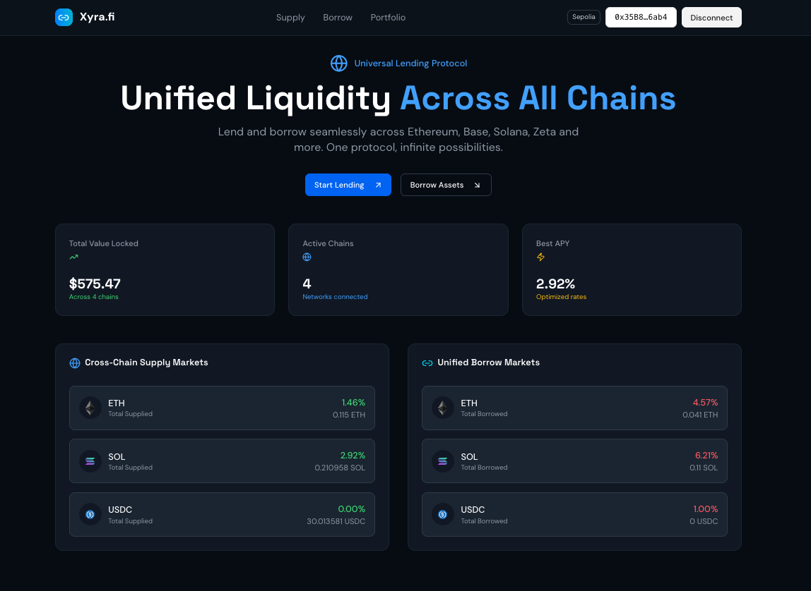
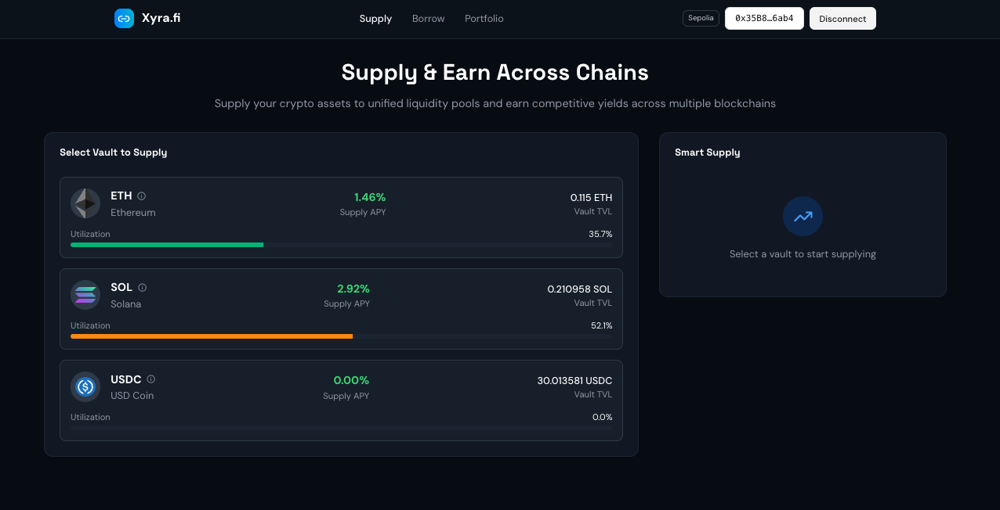
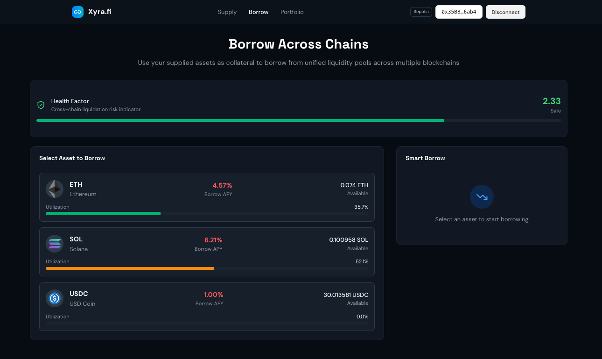
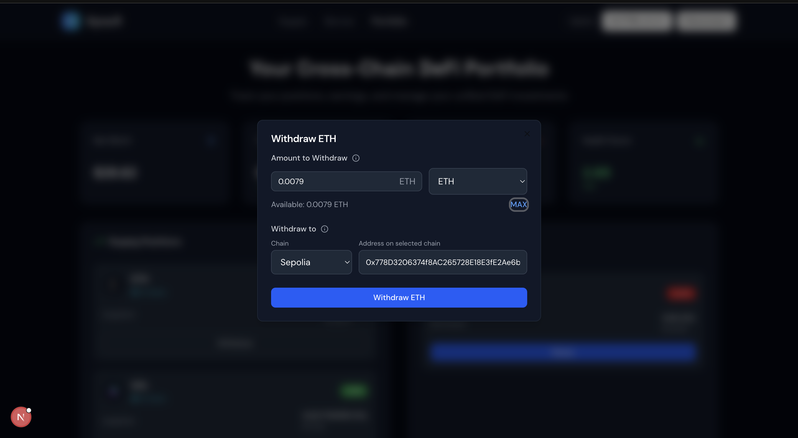
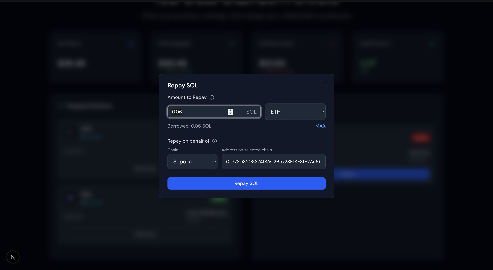
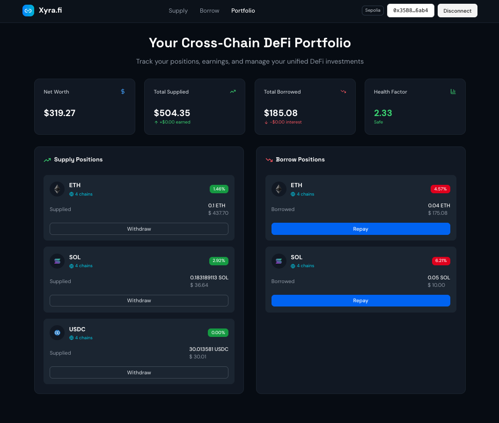
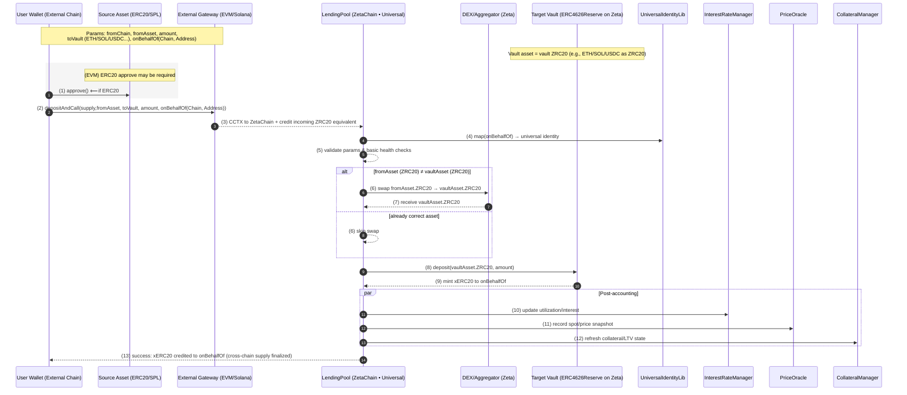
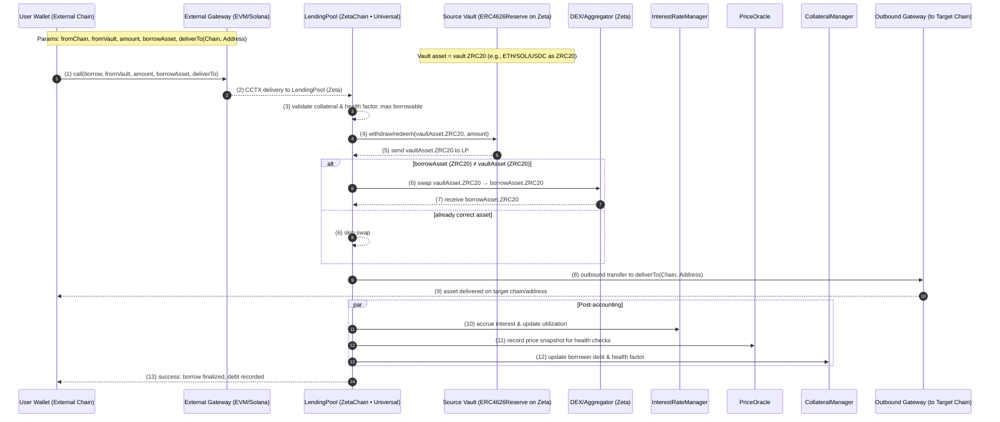

# Xyra

**Xyra** is a **universal cross-chain lending protocol** built on [ZetaChain](https://www.zetachain.com/).
It unifies liquidity across multiple blockchains, enabling seamless supply, borrow, repay, and withdraw actions from any chain to any chain.

---

## 🌐 Overview

### Why Xyra?

Traditional lending protocols are siloed per chain - liquidity on Ethereum, Solana, or Base cannot easily interact. Xyra.Fi leverages ZetaChain’s **universal smart contracts** to unify liquidity, letting users supply and borrow across chains without bridging or manual swaps.







---

## 🏗️ Project Structure

```
Xyra/
├── contracts/                  # Solidity smart contracts
│   ├── src/                    # Protocol source code
│   │   ├── pool/               # LendingPool, PoolManager
│   │   ├── vaults/             # ERC4626 reserves
│   │   ├── interestRate/       # Interest rate logic
│   │   ├── liquidation/        # Liquidation mechanisms
│   │   ├── oracle/             # Price oracles
│   │   ├── swap/               # Cross-chain swap integration via Uni V2
│   │   ├── accessControl/      # Role & access control
│   │   ├── collateral/         # Collateral management
│   │   └── protocol/           # Base + Universal contracts
│   ├── script/                 # Deployment & setup scripts
│   └── test/                   # Foundry unit tests
│
├── e2e/                        # End-to-end cross-chain tests
│   └── src/                    # Scripts for testing cross-chain calls
│
├── frontend/                   # Next.js frontend app
│   ├── app/                    # Pages (home, supply, borrow, portfolio)
│   ├── lib/                    # Chain configs, ABIs, utilities, Zeta Gateway Interaction
│   └── components/             # Reusable UI components
│
└── README.md                   # Project documentation

```

---

## ✨ Features

- **Supply to Vaults**

  - Supply liquidity from **Ethereum Sepolia**, **Base Sepolia**, **Zeta Athens**, or **Solana Devnet**.
  - Supply can be done **on behalf of another address**.
  - If the supplied asset differs from the vault’s reserve asset, it is **automatically swapped**.

- **Borrow Across Chains**

  - Borrow from vaults to any chain and any address.
  - Assets are **swapped internally** if the borrowed asset differs from the vault’s underlying.

- **Withdraw Anywhere**

  - Withdraw supplied liquidity to a specific chain and address.
  - Withdrawals also support cross-asset swaps.

- **Repay Flexibly**

  - Repay borrowed positions from **any chain**, **any asset**, and even **on behalf of another address**.

---

## How It Works

### Supply



## Borrow



---

---

## 🚀 Deployments

### 🌐 Frontend

The Xyra frontend is live on Vercel:  
👉 [https://xyra-sigma.vercel.app/](https://xyra-sigma.vercel.app/)

### ⛓️ Contracts (ZetaChain Testnet)

- **LendingPool (Main)**  
  [`0x3e89A980F8f160228Bc37E2f95ceF2c8d5e443b2`](https://athens.explorer.zetachain.com/address/0x3e89A980F8f160228Bc37E2f95ceF2c8d5e443b2)

- AccessControlManager  
  [`0x01335A08Fd2de2F57794E9DC081a11936F139DC1`](https://athens.explorer.zetachain.com/address/0x01335A08Fd2de2F57794E9DC081a11936F139DC1)

- PriceOracle  
  [`0xDd33f3F29f1D41FF7E82ce4bb861051DAE0a7e5E`](https://athens.explorer.zetachain.com/address/0xDd33f3F29f1D41FF7E82ce4bb861051DAE0a7e5E)

- InterestRateManager  
  [`0xe64e99D90a702d5F40b80730A8beE7F0B1c21186`](https://athens.explorer.zetachain.com/address/0xe64e99D90a702d5F40b80730A8beE7F0B1c21186)

- CollateralManager  
  [`0xa2A7B313Cc506c8D8887FCAbEbd58E4d1BE567Fe`](https://athens.explorer.zetachain.com/address/0xa2A7B313Cc506c8D8887FCAbEbd58E4d1BE567Fe)

- PoolManager  
  [`0xf76C0491B360Ce9625226C85A70b6C6516dFf7AF`](https://athens.explorer.zetachain.com/address/0xf76C0491B360Ce9625226C85A70b6C6516dFf7AF)

- Swap  
  [`0xDaC125f9350cD25786Cfd5c8eb2b6837c5e7Ce6B`](https://athens.explorer.zetachain.com/address/0xDaC125f9350cD25786Cfd5c8eb2b6837c5e7Ce6B)

---

## 📊 Supported Networks

| Action             | Sepolia | Base Sepolia | Zeta Athens | Solana Devnet |
| ------------------ | ------- | ------------ | ----------- | ------------- |
| Wallet Connections | ✅      | ✅           | ✅          | ✅            |
| Interact via       | ✅      | ✅           | ✅          | Coming Soon   |
| Supply             | ✅      | ✅           | ✅          | ✅            |
| Borrow             | ✅      | ✅           | ✅          | ✅            |
| Withdraw           | ✅      | ✅           | ✅          | ✅            |
| Repay              | ✅      | ✅           | ✅          | ✅            |

---

## 🚀 Getting Started

### Prerequisites

- [Foundry](https://book.getfoundry.sh/) for smart contracts
- [Node.js](https://nodejs.org/) + [pnpm](https://pnpm.io/) for frontend
- [Zeta Universal CLI](https://www.zetachain.com/docs) for cross-chain calls and running E2E Test cases
- Setup `.env` as required by each subdir

### Contracts

```bash
cd contracts
forge install
forge build
forge test
```

### Frontend

```bash
cd frontend
pnpm install
pnpm dev
```

### E2E Tests

```bash
cd e2e
npm install
npm test
```

## 👥 Contributors

Made with ❤️ by

- [@Aman035](https://github.com/Aman035)
- [@0xnilesh](https://github.com/0xnilesh)

for the **ZetaChain × Google Cloud AI Buildathon** 🚀
